# Role listview

## Introduction

For years, Microsoft has used the so-called Liswview role in Windows Explorer to display files and folders. Visually, there are several display types for the list:
* Details
* List
* Contents
* Symbols
* Tiles

## Examples for Listviews

### Microsoft Windows - File Explorer
Files can be arranged in different views for a better overview, preview of content or to expose different properties.

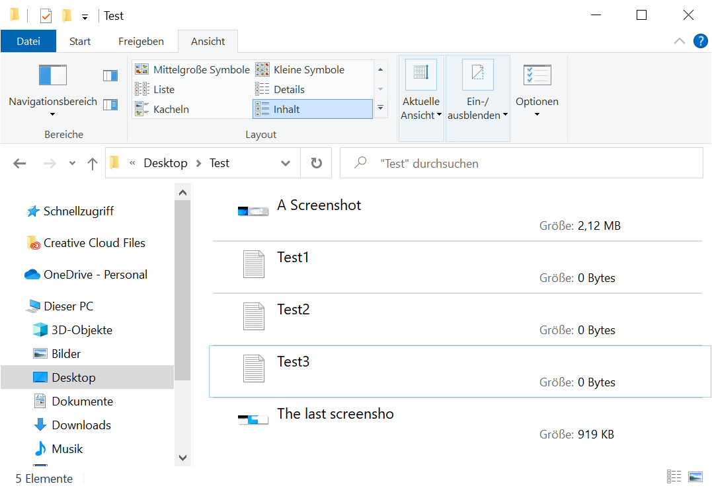

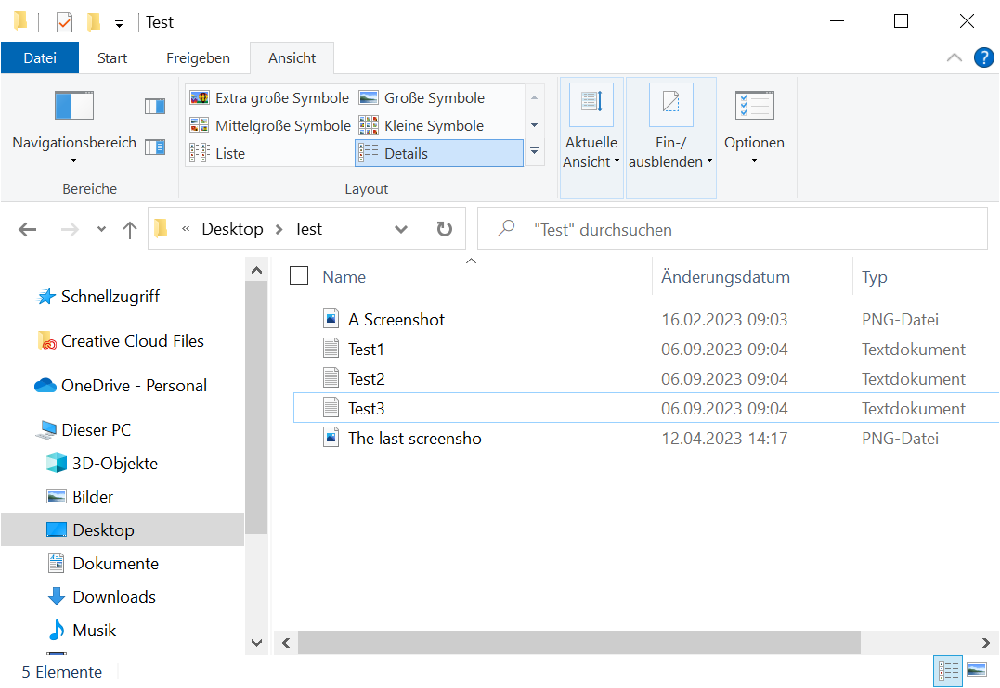

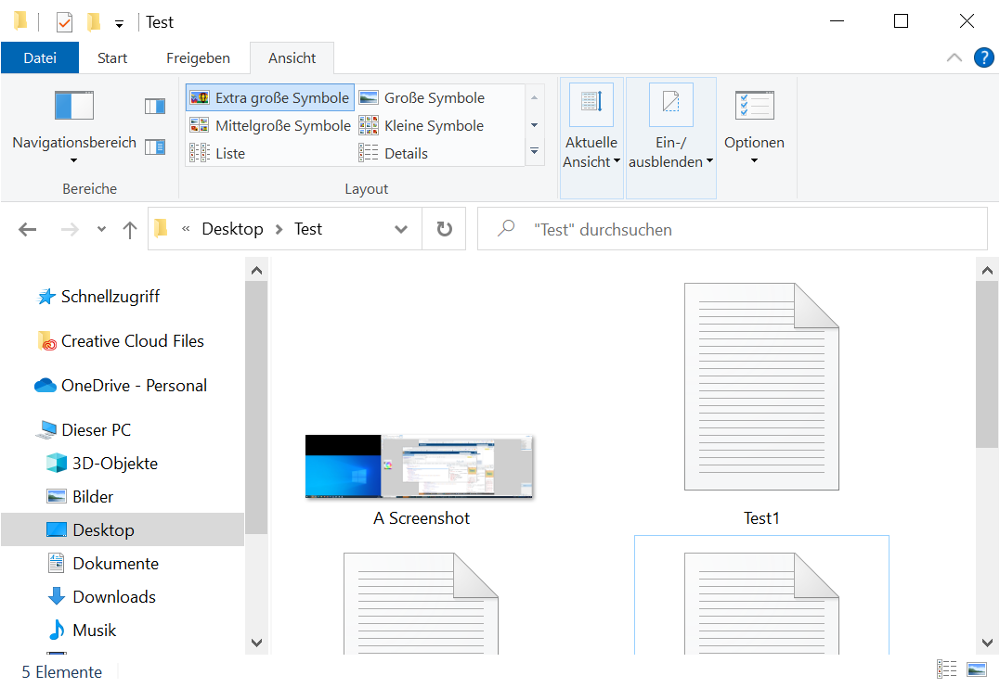

### Mac OSX - Finder

The functionalities covered by the finder are comparable to the ones offered by the Microsofts file explorer.

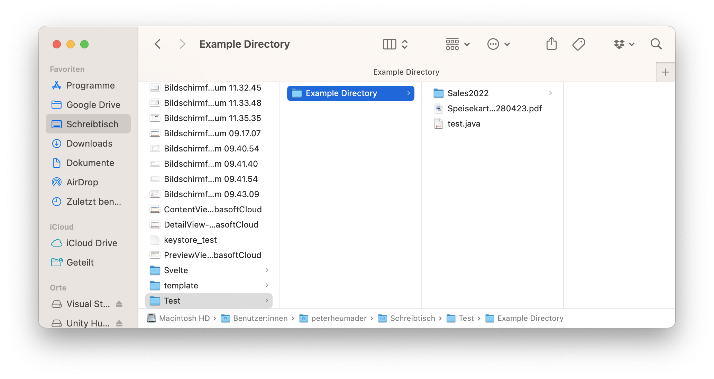

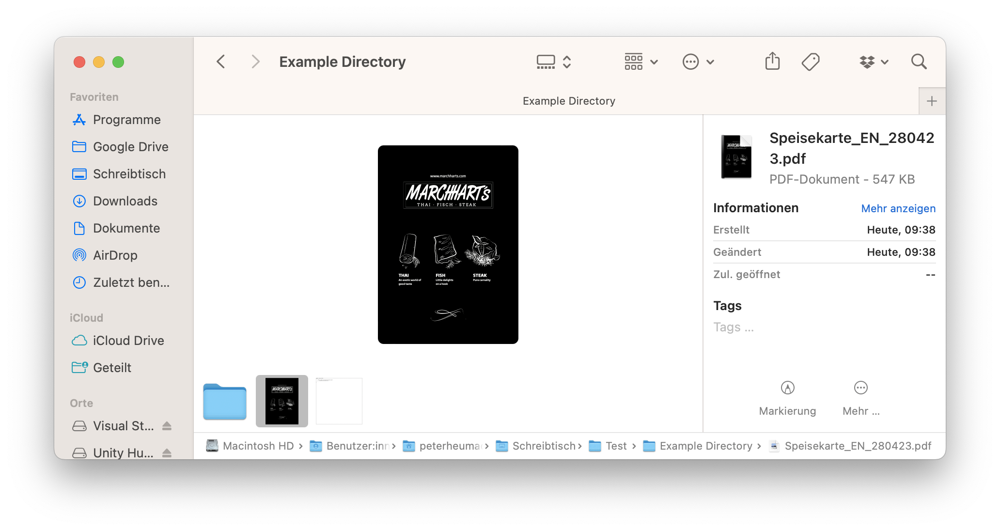

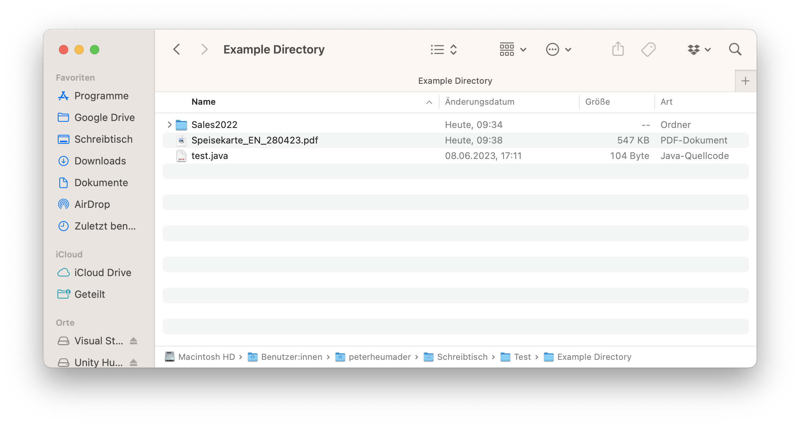

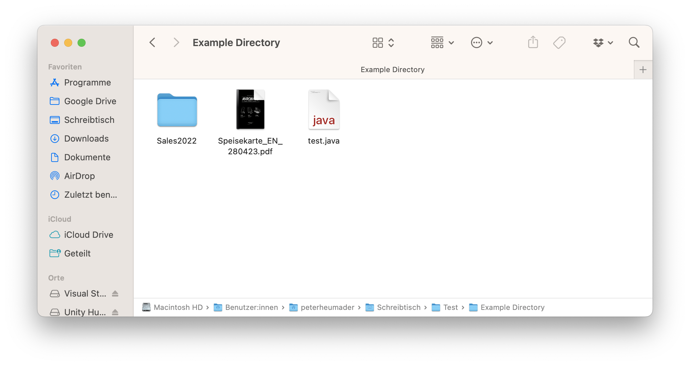

### Fabasoft Cloud

As an example for an online platform where files and objects can be arranged in different views is Fabasofts Cloud. 

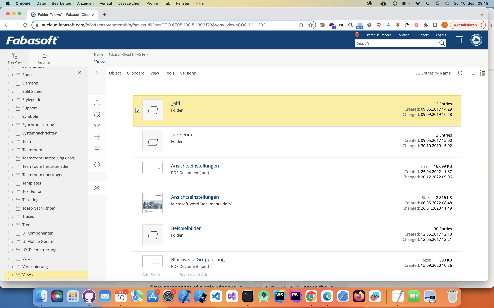

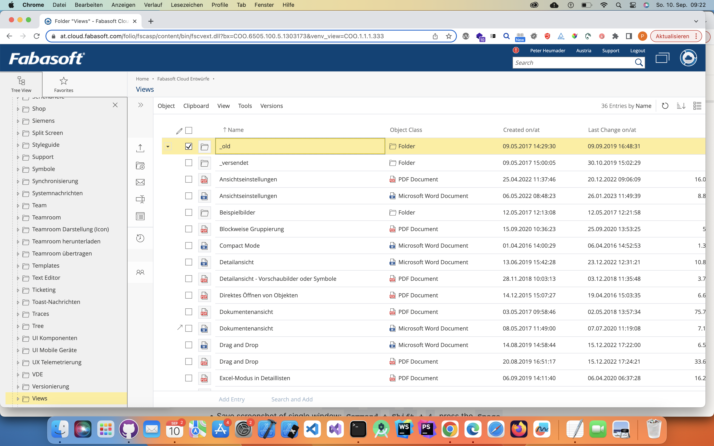

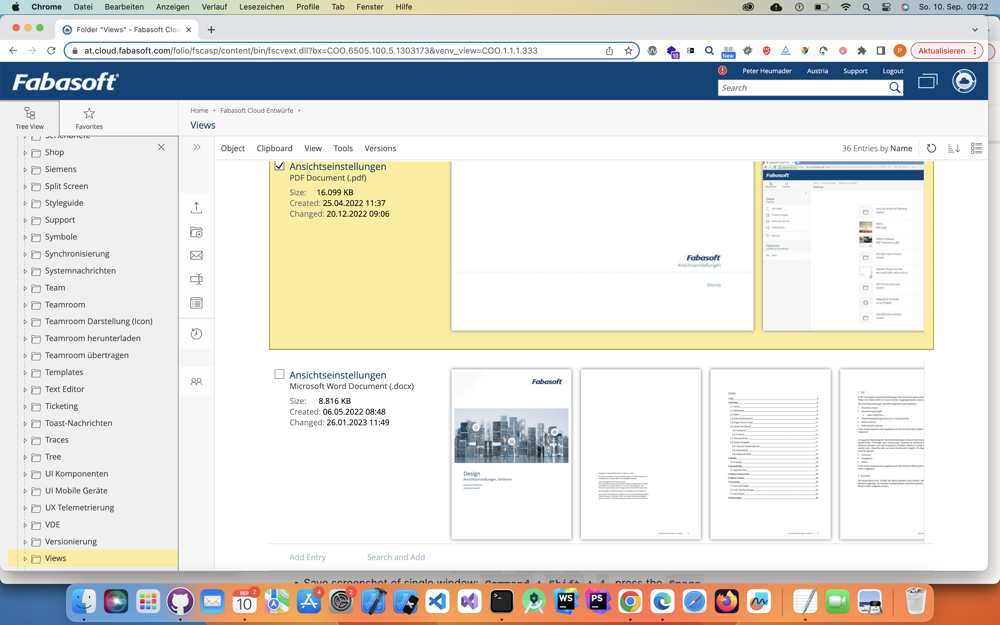

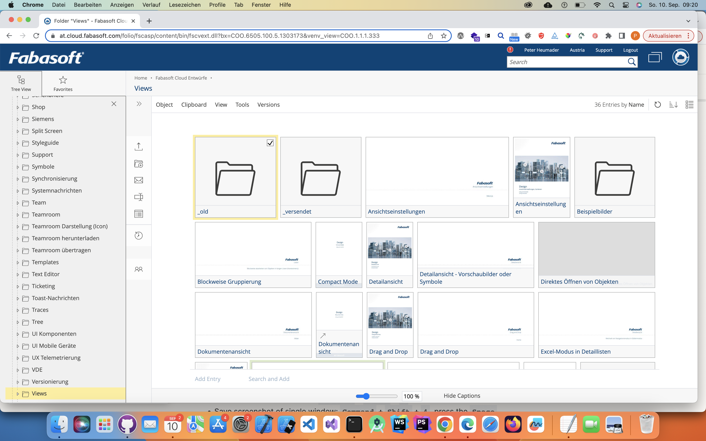

## The role listview

The real problem for AT users, especially screen reader users is, that without this role the list has to change the roles tue to different display types from grid to treegrid (grouped lsit), to listbox (at the time the only possibility to display listview in list, content and tile type). The empty list ist at the time also a big problem.

As Sarah and Stefan suggested years ago, we also propose another complex role: 
listview.

The listview role should contain the following semantic properties:

### Accessibility children roles:
- featureheaders
- group
- listviewitem

### Listview attributes

- aria-listviewtype
  - details | list | contents | tiles | symbols | thumbnails
- aria-multiselectable
- aria-readonly
- aria-listviewfilter
  - IDRef to the filter widget

